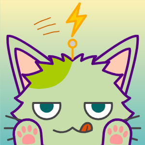
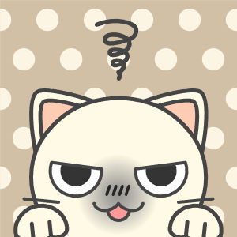
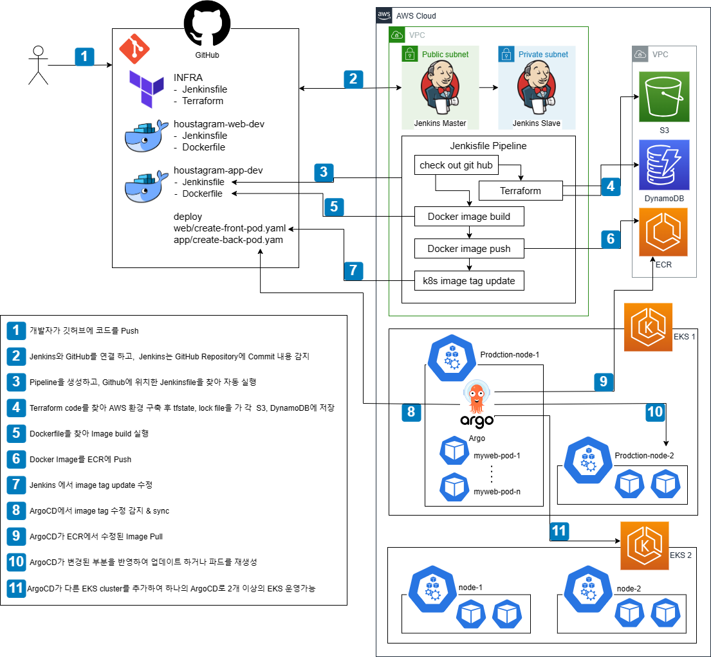
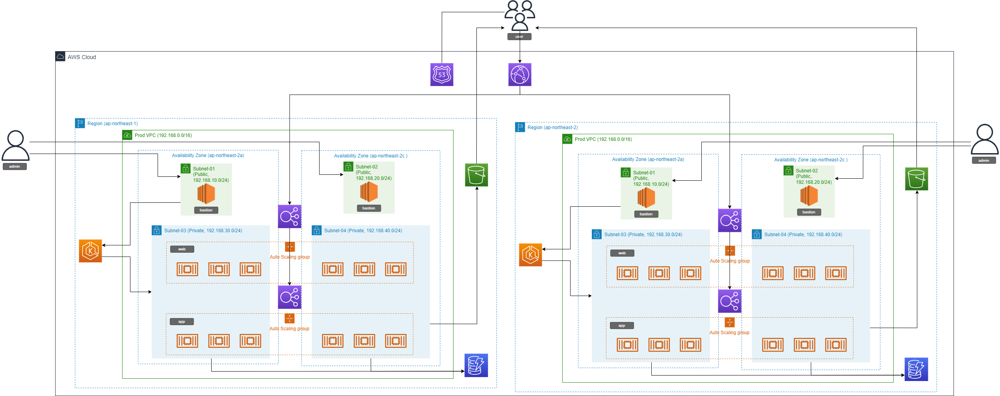
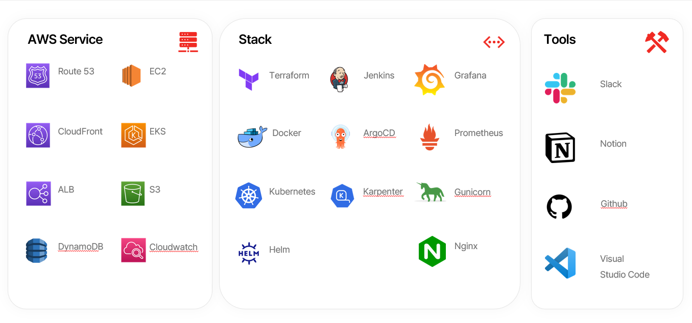

<h1> 🚀 TEAM. RoCAT-Motion </h1>

  

 
<h3 align="center">🏠 Houstagram! 🏠</h3>

- **팀 명 :**  Team RoCATmotion
- **프로젝트 명 :** SNS 시스템 설계 및 구축
- **프로젝트 기간 :** 2023.05.30 ~ 2023.07.20
- **팀원 :** 백승준(팀장), 김호현, 이정훈, 은효경
- **노션 :** [🗂️ 노션 ](https://www.notion.so/6b6d769f8b96480b9e54e11ad8116778?v=8675726117704b729b249614526fec92&pvs=4)
- **배포 링크 :** [🏠 Houstagram](http://houstagram.com/)

# 🚀TEAM MEMBER

|||||
|:---:|:---:|:---:|:---:|
|[백승준](https://github.com/Santhaim)|[김호현](https://github.com/kimohyeon)|[이정훈](https://github.com/gugucone999)|[은효경](https://github.com/MintBANG)|
|팀장|팀원|팀원|팀원|
|
 - Terraform   - Route 53|
 - VPC/Subnet   - EKS-3tier   - EKS-ALB |
 - CI/CD Server   - Jenkins   - ArgoCD | 
 - Monitoring   - Total Manual & PPT|
  

 

## ⏱️Time-Line

 

# 🗂️ Architecture
|||
|:---:|:---:|
|🗂️네트워크 디자인|🧩CICD|
### 단계별 아키텍처
||||
|:---:|:---:|:---:|
|🌒1단계|🌓2단계|🌕3단계|

 

# 📢 STACK

 

## 💻Clone-Coding
- `FRONT` : 💫[FRONT](https://github.com/ONE-OF-WORLD/FINAL-FRONT)
- `BACK` : 💫[BACK](https://github.com/ONE-OF-WORLD/FINAL-BACK)
