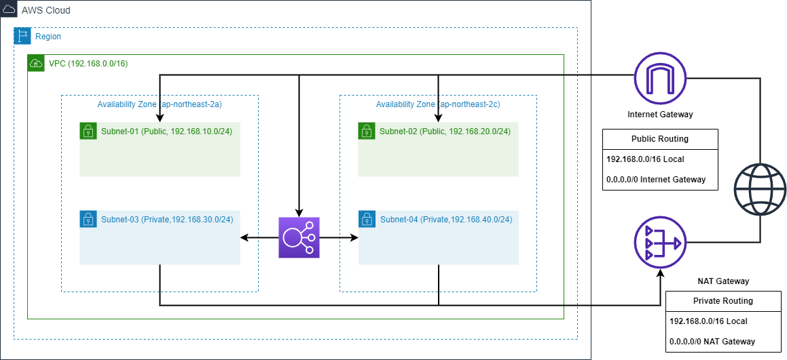
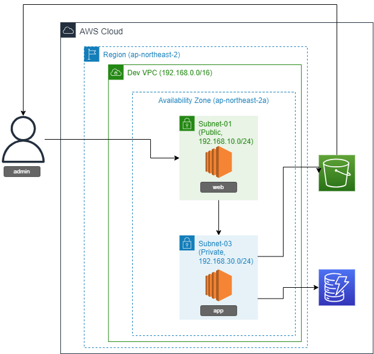
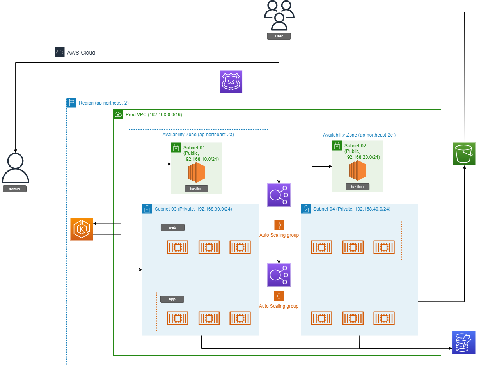

# 🚀TEAM. RoCAT Motion

 
  
 

<b>💫SNS 시스템 설계 및 구축 </b> 
 💫팀명 : 로캣모션 (roCATmotion)  
 💫프로젝트 기간: 2023.05.30 ~ 2023.07.20 

# 🗒️베포주 : [UNNAME](http://houstagram.com/)

# 🚀TEAM MEMBER

|||||
|:---:|:---:|:---:|:---:|
|[백승준](https://github.com/Santhaim)|[김호현](https://github.com/kimohyeon)|[이정훈](https://github.com/gugucone999)|[은효경](https://github.com/MintBANG)|
|팀장|팀원|팀원|팀원|

담당 역할

**🚀백승준 (TEAM LEADER)**

**🚀김호현**

**🚀이정훈**

**🚀은효경**
 

 

# 🗂️ Architecture

|||
|:---:|:---:|
|🗂️네트워크 디자인|🧩CICD|

||||
|:---:|:---:|:---:|
|🌒1단계|🌓2단계|🌕3단계|

# VIEW

# 📢 STACK

 🗒️Front-Back 

 
  
  
   

 

 🧩 CICD 

 
 

 

 ⚓ Container 

 
 

 

 🧷 IaC 

 
  

 

 🖥️ Monitoring 

 
 

 

 ⛓️TOOLS 

 
 
 
  
 
 
 
   

## 💻Clone-Coding
- `FRONT` : 💫[FRONT](https://github.com/ONE-OF-WORLD/FINAL-FRONT)
- `BACK` : 💫[BACK](https://github.com/ONE-OF-WORLD/FINAL-BACK)
